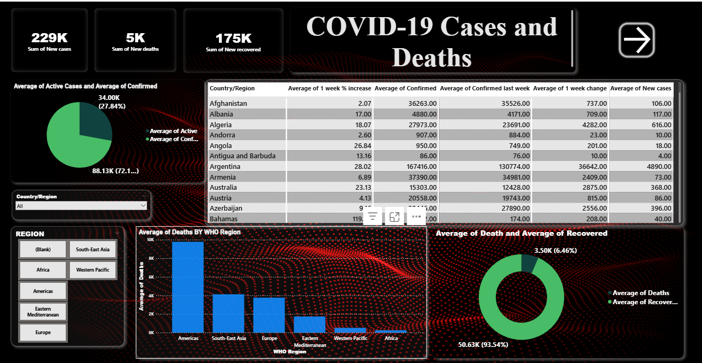
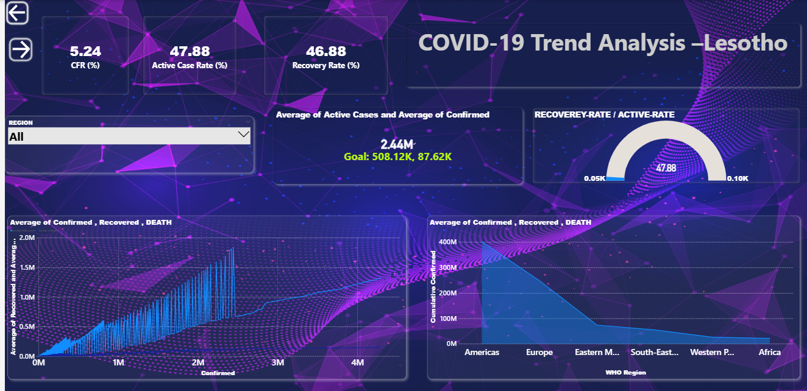
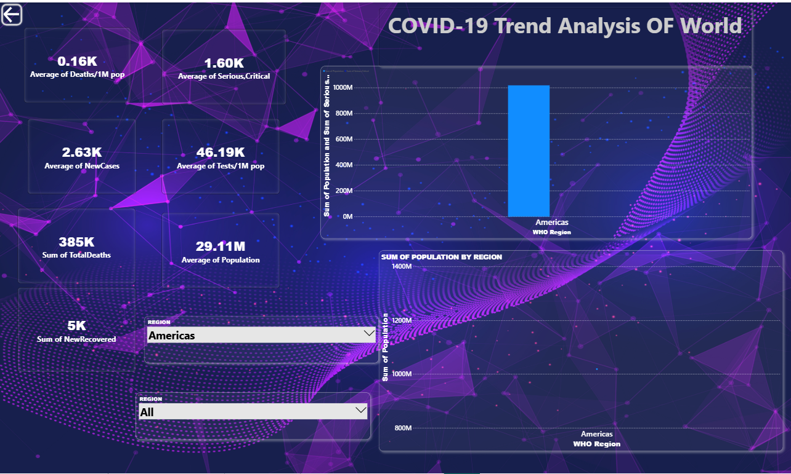

<!DOCTYPE html>
<html lang="en">
<head>
    <meta charset="UTF-8">
    
</head>
<body>

  <h1>📊 COVID-19 Power BI Dashboard</h1>

  <h1>📸 Dashboard Previews</h1>

  <h2>1️⃣ Global COVID-19 Overview</h2>
  

  <h2>2️⃣ COVID-19 Analysis - Lesotho</h2>
  

  <h2>3️⃣ Global COVID-19 Trends</h2>
  

  <h1>📁 Project Overview</h1>
  
This Power BI project analyzes COVID-19 data globally and by country. It includes KPIs such as new cases, deaths, recovery rates, and regional trends. Filters allow insights by WHO region and country.

  <h1>📦 Dataset</h1>
  
<strong>Source:</strong> Aggregated COVID-19 dataset with daily stats and WHO classifications.

  <h1>🔍 Dashboard Features</h1>
  <ul>
      <li>KPIs: New Cases, Deaths, Recoveries</li>
      <li>Rates: CFR, Recovery, Active Cases</li>
      <li>Visuals: Line charts, Donut charts, Bar charts</li>
      <li>Interactive filtering by country/region</li>
  </ul>

  <h1>🧮 Key DAX Measures</h1>
  <ul>
      <li><code>CFR = DIVIDE([Total Deaths], [Total Confirmed], 0)</code></li>
      <li><code>Recovery Rate = DIVIDE([Total Recovered], [Total Confirmed], 0)</code></li>
      <li><code>Active Rate = DIVIDE([Total Active], [Total Confirmed], 0)</code></li>
  </ul>

  <h1>👨‍💻 Author</h1>
  
<strong>JUNAID KHAN</strong> Power BI Developer & Data Analyst

</body>
</html>
